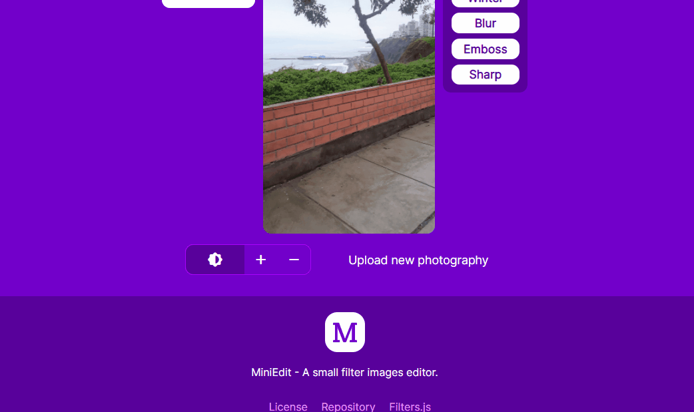
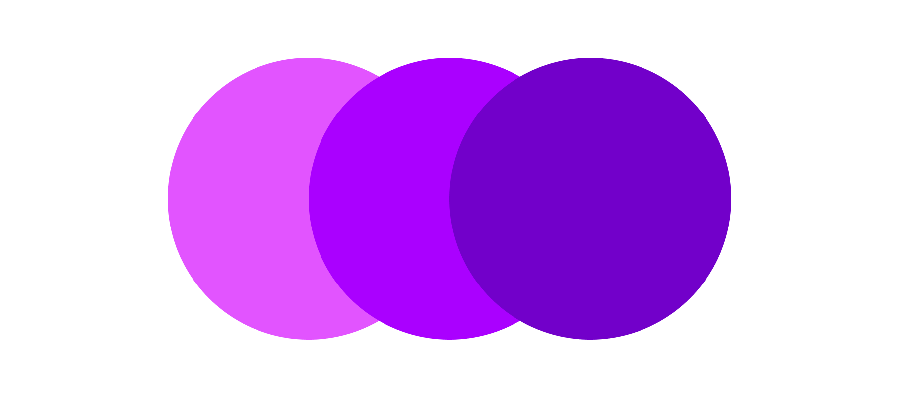

  
  <h1 align="center">MiniEdit</h1>

  📱 A small filter images editor. 📷

## 📦 Deployment
MiniEdit is a web tool for applying simple filters to photos. It is deployed on GitHub Pages, since it does not use any backend but rather vanilla JavaScript for storing and modifying images.

## 🏛️ History
The idea came about after reviewing kousik348's project, Foto.js, a class with methods that modify a photograph by applying filters and effects. I did some code refactoring, and added more filters for this project.

I then proceeded to design the responsive user interface. Using a color palette obtained through Material.io Colors.

Finally I made some adjustments to improve the performance in terms of page loading with a metric result between 90-95 in Google Lighthouse Performance.

## 🎨 UI Design
Color palette used:

## 🤲 Contributing

Do you would like to contribute? Do you want to be the author of a new feature? Awesome! please fork the repository and make changes as you like. [Pull requests](https://github.com/360macky/miniedit/pulls) are warmly welcome.

## 📃 License

Distributed under the MIT License except for the [fork original from kousik19](https://rawcdn.githack.com/kousik19/foto.js/d604b02c69b6f037875bc4a3050b85d776dc4659/foto.js).
